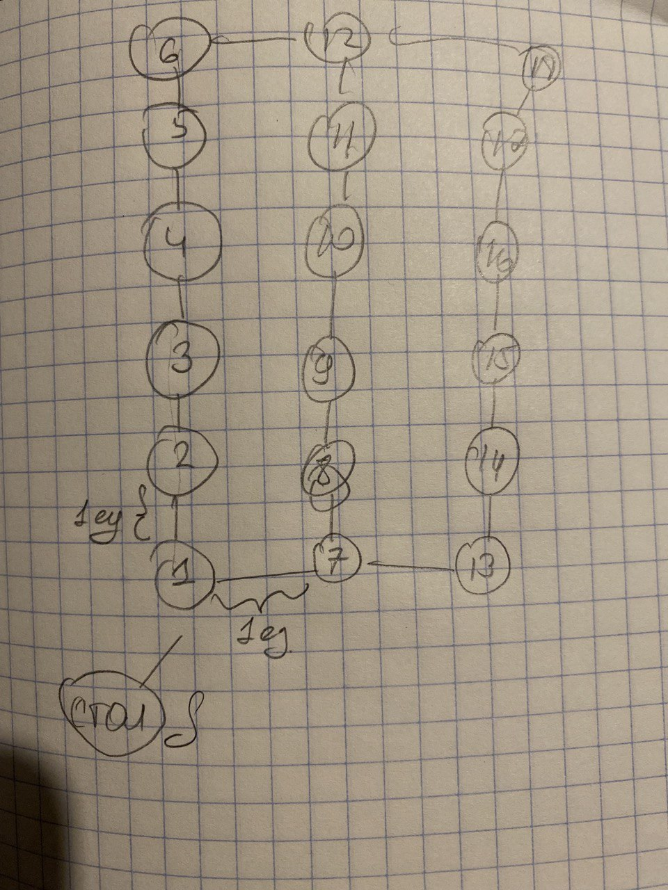

## Разбор рисунка на графы

> Во-первых, я пронумеровал все ячейки на складе, чтобы удобнее обращаться к ним.
> Во-вторых, я построил граф, соединив каждую ячейку с соседними по горизонтали и вертикали. Я также добавил вершину S, соответствующую столу кладовщика, и соединил ее с ближайшими ячейками. Вес каждого ребра равен расстоянию между вершинами в единицах измерения. Я выбрал единицу измерения, равную ширине полки или прохода. Тогда длина каждого ряда стеллажей равна 6 единиц, а длина каждого стеллажа - 5 единиц.

## Построение графа

> Затем я построю граф, соединив каждую ячейку с соседними по горизонтали и вертикали. Я также добавлю вершину S, соответствующую столу кладовщика, и соединю ее с ближайшими ячейками. Вес каждого ребра будет равен расстоянию между вершинами в единицах измерения.

## Алгоритм

> Теперь я могу применить алгоритм поиска кратчайшего пути в графе, например, алгоритм Дейкстры. Я буду искать кратчайший путь от вершины S до всех остальных вершин и обратно. Я буду учитывать порядок, в котором кладовщик должен посетить ячейки из перечня. Я буду минимизировать суммарную длину пути.

## Пример

> Предположим, что перечень ячеек выглядит так: 
> 1 стеллаж - 3, 1 стеллаж - 6, 2 стеллаж - 9, 3 стеллаж - 15.
> Тогда оптимальный маршрут кладовщика будет таким:
* S-1 > 1-2 > 1-3
* 1-3 > 1-4 > 1-5 > 1-6
* 1-6 > 2-12 > 2-11 > 2-10 > 2-9
* 2-9 > 2-8 > 2-7 > 2-13 > 2-14 > 2-15
